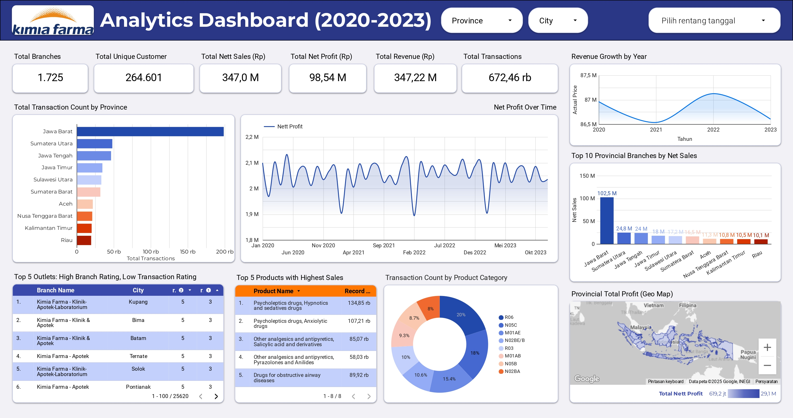

# 📊 Big Data Analytics — Kimia Farma 2020–2023

Proyek ini merupakan bagian dari program **Big Data Analytics Internship** yang berfokus pada evaluasi kinerja bisnis **Kimia Farma** periode 2020–2023. Analisis dilakukan dengan mengolah data transaksi, produk, cabang, dan inventori menggunakan **Google BigQuery**, kemudian divisualisasikan dalam **Google Looker Studio**.

🔗 **Dashboard Interaktif:**  

[Click here to see the dashboard on Looker Studio](https://lookerstudio.google.com/reporting/7894445b-4bd2-4db3-a289-d153dd234083)

---

## 🚀 Project Workflow
1. **Importing Dataset ke BigQuery**
   - `kf_final_transaction.csv`  
   - `kf_inventory.csv`  
   - `kf_kantor_cabang.csv`  
   - `kf_product.csv`  

2. **Membuat Tabel Analisa**
   - Join data transaksi, cabang, dan produk.
   - Tambahkan kolom analitis:  
     - `nett_sales` (harga setelah diskon)  
     - `nett_profit` (keuntungan setelah laba kotor)  
     - `persentase_gross_laba` (berdasarkan range harga produk)  

3. **Visualisasi di Looker Studio**
   - KPI utama (nett sales, nett profit, transaksi, cabang, pelanggan).  
   - Grafik tren revenue & profit (2020–2023).  
   - Distribusi transaksi & profit per provinsi.  
   - Analisis top product & kategori produk.  
   - Perbandingan rating cabang vs rating transaksi.  

---

## 📈 Insights Utama
- **Jawa Barat** menjadi provinsi dengan kontribusi transaksi dan penjualan terbesar (nett sales > 100 M).  
- Produk paling laku berasal dari kategori **psycholeptics** dan **analgesics & antipyretics**.  
- Revenue sempat **turun pada 2021** akibat pandemi, meningkat di 2022, lalu kembali menurun pada 2023.  
- Beberapa outlet memiliki **rating cabang tinggi** namun **rating transaksi rendah**, menandakan perlu ada perbaikan pada pengalaman layanan pelanggan.  

---

## 🛠️ Tools & Technologies
- **Google BigQuery** → Data warehouse & SQL queries  
- **Google Looker Studio** → Data visualization & dashboard  
